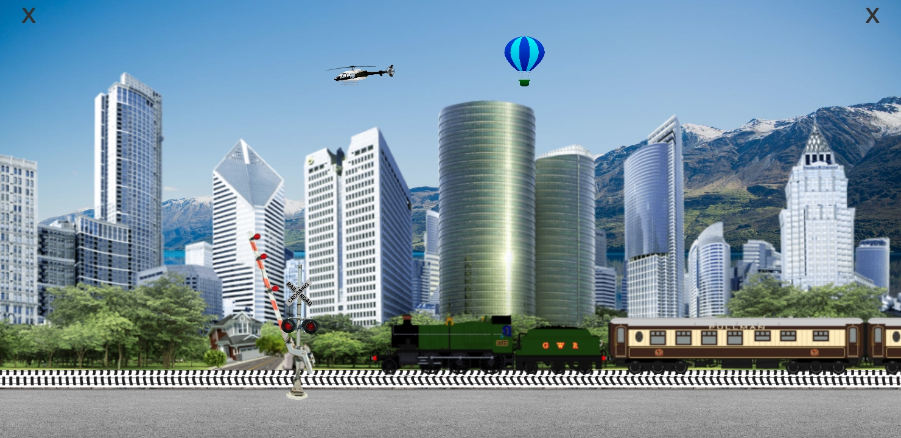

# Trains game 
Game for young children 
(Mini project written in c# Visual Studio / Unity 2020)

## Gra napisana dla mojego dwuletniego syna.
### Co już napisano:
#### Dzwięki
* Podkład musyczny (spokojna melodia)
* kliki, pękanie balonu, obiekty
#### Helikopter
* przylatuje z losowych miejsc z prawej i lewej strony
* helikopter czasami ląduje na dachu budynku.
* interakcja - po kliknięciu przyspiesza lub startuje
* losowe prędkości i  5 rodzajów śmigłowców
#### Balon
* Przylatuje z losowych miejsc z prawej i lewej strony
* losowe prędkości i kolory balonu
* czasami przelatuje przed budynkami i jest większy
* interakcja - po kliknięciu przyspiesza
#### Przejazd kolejowy / semafor
* zamykanie i otwieranie po kliknięciu
* animacja świateł na semaforze
* animacja świateł na szlabanie
* automatyczne zamykanie szlabanu gdy nadjeżdza pociąg i otwieranie gdy odjedzie
#### Pociągi
* na razie jeden pociąg osobowy
* animacja jazdy
* losowy kierunek jazdy
* wykrywanie czy szlaban jest otwarty czy zakmnięty i zatrzymywanie się
#### Dwa przyciski [X]
* dwa przyciski do zamykania by dziecko przez przypadek nie zamknęło
* trzeba naciśnąć dwa przyciski w odstępie krótszym niż 1.5sec

### Dane :
Paczka z plikami : UNITYPACKAGE/moja paczka Pociagi.unitypackage
Wersja Unity : Unity 2020.1.3f1 (64-bit)
System : Windows 10 64bit
Telefon : Samsung J6+

## Screen from 28.08.2020 :
