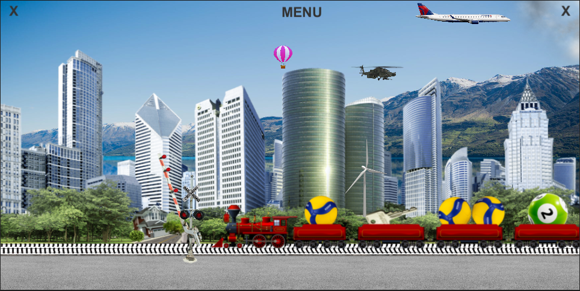

# Trains game 
Game for young children 
(Mini project written in c# Visual Studio / Unity 2020)

## a game written for my two-year-old son.

### Scene 1 interaction:
flying balloons, helicopters (sometimes lands on a building), 7 different trains, a semaphore, a controlled barrier, a controlled wind turbine, a train horn, stopping trains, flying cloud, 6 different airplane.
### Scene 2 interaction:
bubbles or clocks flying out of the tap, added physics, friction and elasticity. you can click on bubbles and timers to destroy them.

### Data :
<ul>
<li>package with files : UNITYPACKAGE/moja paczka Pociagi.unitypackage</li>
<li>Version Unity : Unity 2020.1.3f1 (64-bit)</li>
<li>System : Windows 10 64bit</li>
<li>Smartfon test : Samsung J6+, Samsung j5</li>
</ul>

 
